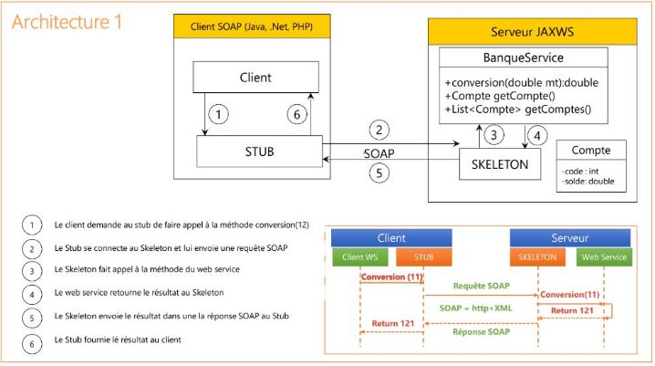
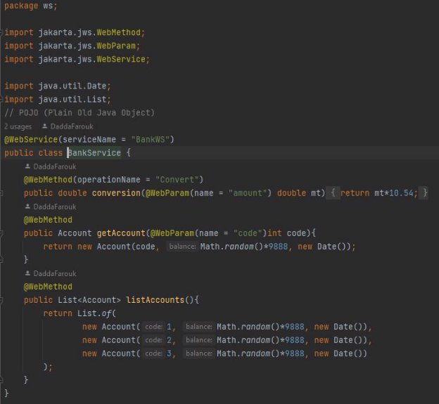
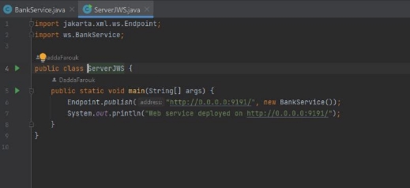
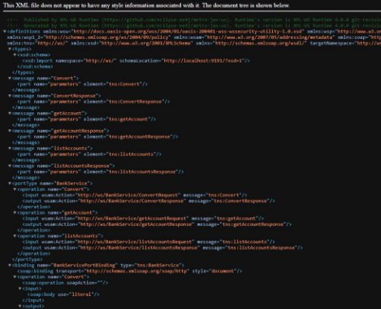

# 
 Compte Rendu Activité Pratique 1 

**
 Développement d'un Web service SOAP, WSDL avec JAWRS 
**

## Énoncé

1. Créer un Web service qui permet de : 
- Convertir un montant de l’auro en DH 
- Consulter un Compte 
- Consulter une Liste de comptes 
2. Déployer le Web service avec un simple Serveur JaxWS 
3. Consulter et analyser le WSDL avec un Browser HTTP
4. Tester les opérations du web service avec un outil comme SoapUI ou Oxygen
5. Créer un Client SOAP Java 
6. Créer un Client SOAP Dot Net
7. Créer un Client SOAP PHP 
8. Déployer le Web Service dans un Projet Spring Boot 

## Architecture 

1. Créer un Web service qui permet de :
- *Convertir un montant de l’auro en DH* 
- *Consulter un Compte* 
- *Consulter une Liste de comptes* 

2. Déployer le Web service avec un simple Serveur JaxWS 

3. Consulter et analyser le WSDL avec un Browser HTTP 

4. Tester les opérations du web service avec un outil comme SoapUI ou Oxygen

5. Créer un Client SOAP Java 

